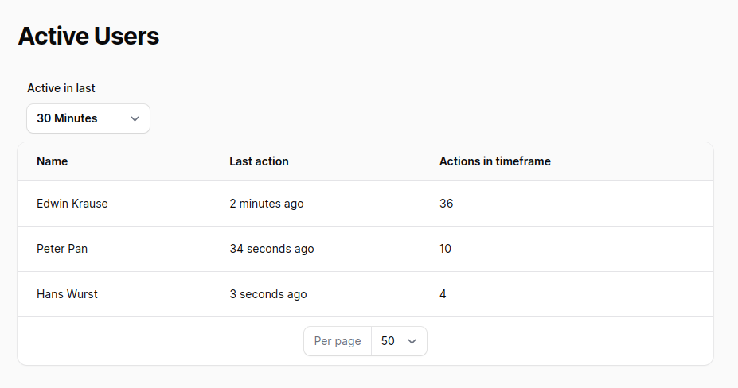

# Tracks user activity and shows currently active users

[](https://packagist.org/packages/edwink/filament-user-activity)
[](https://github.com/edwink/filament-user-activity/actions?query=workflow%3Arun-tests+branch%3Amain)
[](https://github.com/edwink/filament-user-activity/actions?query=workflow%3A"Fix+PHP+code+style+issues"+branch%3Amain)
[](https://packagist.org/packages/edwink/filament-user-activity)



Registers all requests and displays it conveniently to see currently online users, ie. with any requests in the last 15 minutes / 30 minutes / 60 minutes / day / week

## Installation

You can install the package via composer:

```bash
composer require edwink/filament-user-activity
```

You can publish and run the migrations with:

```bash
php artisan vendor:publish --tag="filament-user-activity-migrations"
php artisan migrate
```

You can publish the config file with:

```bash
php artisan vendor:publish --tag="filament-user-activity-config"
```

Optionally, you can publish the views using

```bash
php artisan vendor:publish --tag="filament-user-activity-views"
```

This is the contents of the published config file:

```php
return [
    "table" => [
        "name" => env("FILAMENT_USER_ACTIVITY_TABLE_NAME", "user_activities"),
        "retention-days" => env("FILAMENT_USER_ACTIVITY_RETENTION_DAYS", 60)
    ]
];
```

## Usage
Add Global Middleware in `app/Http/Kernel.php`
```php
    /**
     * The application's global HTTP middleware stack.
     *
     * These middleware are run during every request to your application.
     *
     * @var array<int, class-string|string>
     */
    protected $middleware = [
        ...
        \Edwink\FilamentUserActivity\Http\Middleware\RecordUserActivity::class,
    ];

```

Add trait to User Model `app/Models/User.php` to add relationship `activities`
```php
use Edwink\FilamentUserActivity\Traits\UserActivityTrait;
...

class User extends Authenticatable
{
    use UserActivityTrait;
    ...
}
```

Configure your panel to have 2 additional views
```php
use Edwink\FilamentUserActivity\FilamentUserActivityPlugin;

...
public function panel(Panel $panel): Panel
{
    return $panel
        ...
        ->plugins([
           FilamentUserActivityPlugin::make()
        ])
        ...
}
...
```

Configure a scheduled task to truncate table depending on your configured days (default 60 days) or run is manually
```bash
php artisan filament-user-activity:truncate-activities-table

```


## Contributing

Please see [CONTRIBUTING](.github/CONTRIBUTING.md) for details.

## Security Vulnerabilities

Please review [our security policy](../../security/policy) on how to report security vulnerabilities.

## Credits

- [Edwin Krause](https://github.com/edwink75)
- [All Contributors](../../contributors)

## License

The MIT License (MIT). Please see [License File](LICENSE.md) for more information.
